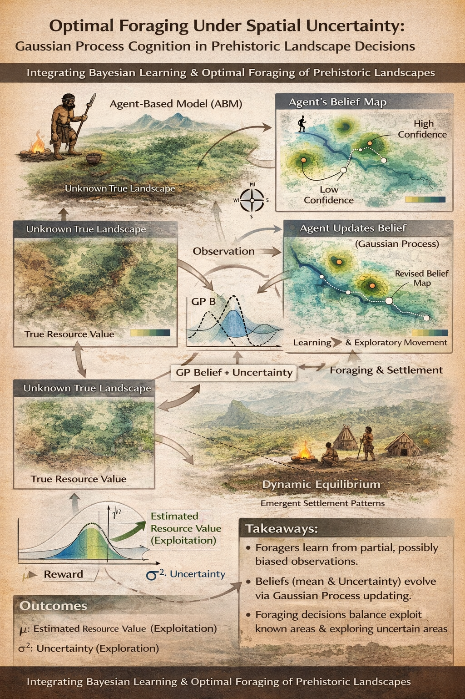

# ABM Gaussian Process Foraging (MVP)

This repository is being rebuilt as a Python package that simulates Bayesian optimal foraging on a 2D grid. The core idea is to compare a GP-driven agent (exploration vs. exploitation via UCB) against simple baselines on unknown resource landscapes. The MVP focuses on a single agent, reproducible runs, and clear visual/metric outputs.

## Project Intent
- Model a latent resource landscape on a raster-like grid (numpy array).
- Let an agent observe noisy samples, fit a Gaussian Process belief, and choose moves via a UCB rule.
- Compare against baseline behaviors (random walk, greedy on noisy samples, optional greedy on true values).
- Produce plots and metrics that reveal learning, exploration, and trajectory structure.

## Scope (MVP)
- 2D square grid, 4- or 8-neighborhood movement.
- Two landscape generators: smooth (Gaussian-filtered noise) and patchy (Gaussian peaks).
- GP belief model using scikit-learn with fixed hyperparameters for speed.
- Outputs: trajectory plot, visitation heatmap, learning curve, and policy comparisons.

## Planned Package Layout
The Python implementation will live under `src/gp_foraging/` with modules for configuration, landscape generation, agent/policies, simulation, metrics, plotting, and a CLI. Legacy R experiments live in `legancy_R/`.

## Status
Product spec and build plan live in `AI_Context/`. Implementation is in progress as we transition to the new Python package.

## Development Setup
- Create a virtual environment (recommended).
- Install dependencies: `pip install -r requirements.txt`
- Run tests: `pytest`

## Key Parameters (Intuition + Expected Effects)
These are the most important knobs for exploring GP-driven foraging behavior.

- `--beta` (exploration weight): Higher values emphasize uncertainty (exploration); lower values exploit known high-mean regions. Expect larger loops and broader visitation at higher beta.
- `--memory-k`: Size of the GP training window. Larger values smooth estimates but can slow adaptation; smaller values react faster to new observations but can be noisier.
- `--obs-noise-std`: Observation noise level. Higher noise makes the agent less confident, leading to more exploration and slower convergence.
- `--landscape-type`: `smooth` vs `patchy`. Smooth fields produce gradual gradients and smoother paths; patchy fields encourage jumps between peaks.
- `--neighborhood`: `von_neumann` (4-neighbor) vs `moore` (8-neighbor). Moore allows diagonal moves and faster spatial coverage.
- `--steps`: Longer runs reveal asymptotic behavior (coverage, uncertainty collapse). Shorter runs emphasize early exploration dynamics.
- `--grid-size`: Larger grids increase exploration demands and make uncertainty reduction slower.

Example intuition checks:
- Increase `--beta` from 1.0 to 2.0 to see wider coverage and slower uncertainty collapse.
- Reduce `--memory-k` (e.g., 75 → 25) to make the agent respond more strongly to recent observations.
